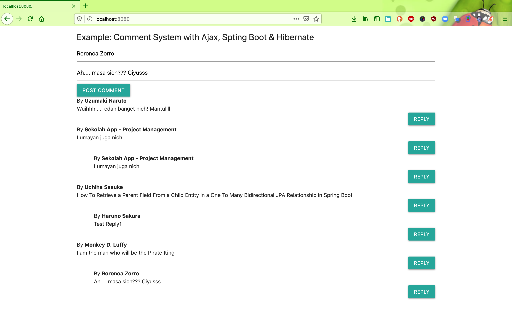

# springboot-comment-system
This is a demo for comments system by SpringBoot & Ajax & Hibernate
<h2>Demo picture</h2>



<h2>Install && Run</h2>
<h3>Install</h3>

```
git clone https://github.com/hendisantika/springboot-comment-system
```

<h3>Run</h3>

Config your mysql in application.properties
```
spring.datasource.url = your mysql url
spring.datasource.username = your mysql user
spring.datasource.password = your mysql password
```

Run with maven
```bash
mvn clean spring-boot:run
```

Open your favorite browser: http://localhost:8080
It's all. For fun.
